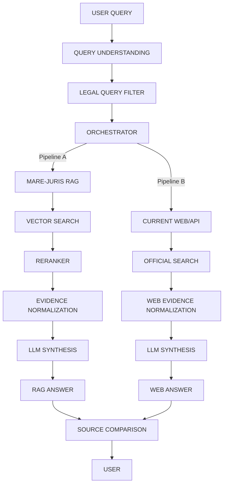

# MARE-Juris RAG Pipeline & Two-Answer System

## 1. Document Corpus Management
The internal RAG is backed by exactly **10 verified legal documents** (Acts, Sanhitas, Constitution) stored dynamically in `legal-documents/`.
During ingestion, if a document is missing, it is queried via the `India Code API`.
Metadata and PDF structure is preserved.

## 2. Supabase Integration
A fully centralized vector database using **PostgreSQL pgvector**.
**Tables:**
- `legal_documents` (Stores document metadata, authority, checksum, etc.)
- `legal_chunks` (Stores chunked content, section headers, and 768-d vector embeddings)

**Retrieval:**
Uses an RPC match function (`match_legal_chunks`) to combine cosine similarity vector search with structured legal evidence retrieval.

## 3. Two-Answer Dual Pipeline
When a user asks a legal query via Ask MARE-Juris:
1. **MARE-JURIS RAG ANSWER (Pipeline A):** Queries the Supabase vector DB (the 10-document corpus) and generates an evidence-grounded response.
2. **LIVE OFFICIAL WEB RESEARCH (Pipeline B):** Synthesizes current web intelligence / India Code API responses for the same query.

These pipelines are kept completely separated. Evidence is never merged prior to generation.

## 4. Source Comparison
Users can invoke `/api/assistant/compare` via the **"Compare Sources"** button in the UI. 
This feature flags potential corpus freshness issues, outdated local statutes, or conflicting legal interpretations.

## 5. Security & Verification
- Strict Row-Level Security (RLS) is applied to all chat histories (`conversations` and `messages`).
- **Prompt Injection Defense:** Strict system prompts prevent the model from executing instructions embedded in the retrieved text.

## Architecture Flow

